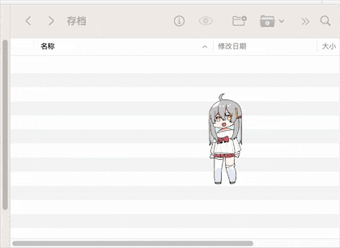
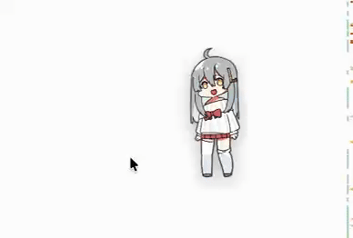
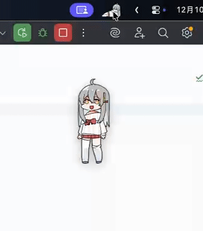

# VPet-Mac

文档传送门：[中文](https://github.com/xiaodiyun/VPet-Mac-PyQt5) |
[English](https://translate.google.com.hk/?sl=zh-CN&tl=en)

虚拟桌宠模拟器mac版，用pyqt5实现。  

源项目传送门：[VPet](https://github.com/LorisYounger/VPet)

本质上是偷了图包之后重写的逻辑，所以和原版可能有较大差别。是的，我没用过这款软件（甚至进不了群，因为我不会用 c# 做 mod！！😭），这也是这个项目诞生的主要目的，mac也要养宠物！

### 版权声明
动画文件版权归 [源项目](https://github.com/LorisYounger/VPet) 所有

### 运行方式
> 带菜单启动：`main_with_menu.py`。需要额外`pip install pyobjc`
> 
> 不带菜单启动：`main.py`

### 开发计划
- 原地动作播放 ✅
- 加入提起动作 ✅   

    
- 加入攀爬等移动动作 ✅  

     
- 加入下落动作 ✅  

     
- 上下触摸交互 ✅  

  
- 加入睡觉交互 ✅（鼠标静止一段时间后自动睡觉）
- 加入吃文件交互 ✅ (附带了复制文件路径和文件归档功能)
    

  
- 加入捏脸交互 ✅

- 增加菜单控制 ✅

- 已经没活了。

